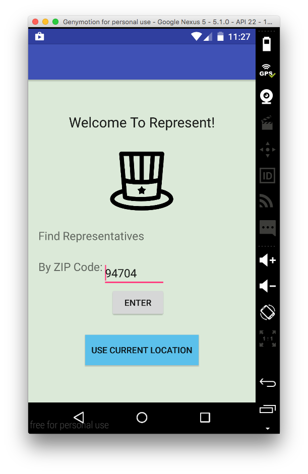
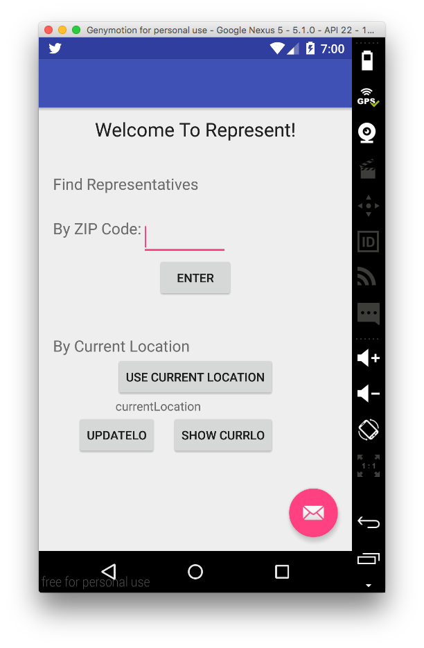
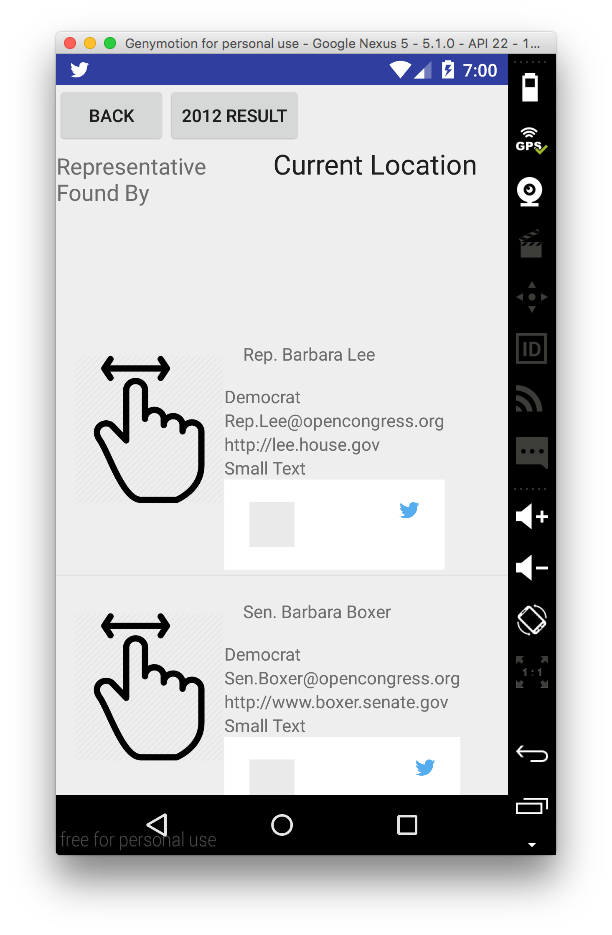
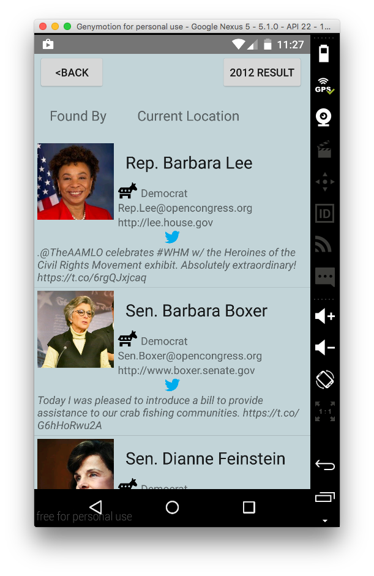
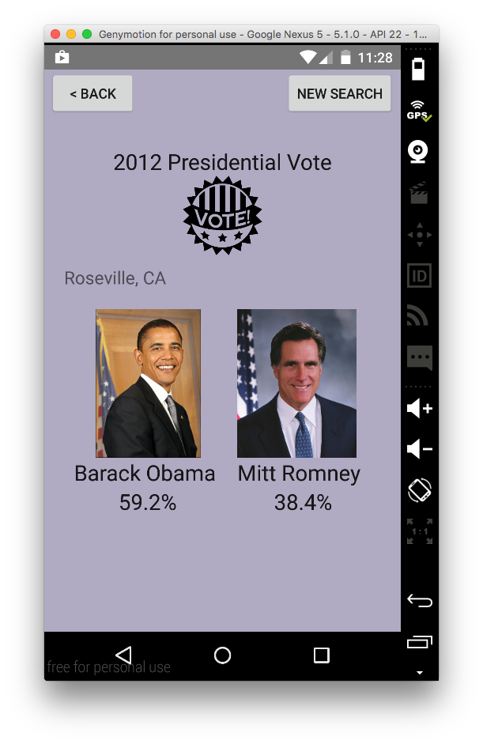
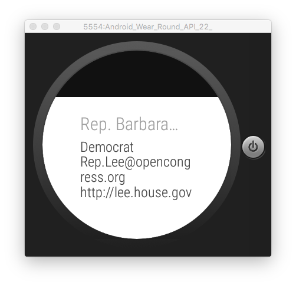

# PROG 02: Represent!

Represent mobile application let you search legislators by ZIP code or curent location. You can see detail of individual, and also you can view 2012 presidential vote result related to the location. Also, it is paired with smartwatch which automatically loads the list of legislators.

## Authors

Kangsik Kevin Lee ([kleekich@berkeley.edu](mailto:kleekich@berkeley.edu))

## Demo Video

See [Represent walk through video] (https://youtu.be/5hg_x9rILys)

## Screenshots

## Description

####1. Find legislators by putting specific zipcode or use current location

**Old version contains unnecessary buttons and texts to guid users. However, it is better to be simple. Also, I added a logo for my mainView.**

####2. The Application loads a list of legislators found by your choice of location
  * You can click individual to view details of the legislator you chose
  * You can also click **"2012 Result"** Button to view 2012 Presidential Vote Result found by the location

** I fixed some layouts to accomodate profile pictures of legislators and tweets. **
####3. Detail View

####4. 2012 Presidentail Vote Result View

####5. Watch View
* You can swipe to see next legislator in the list

